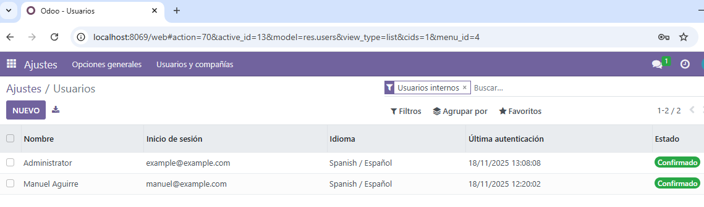
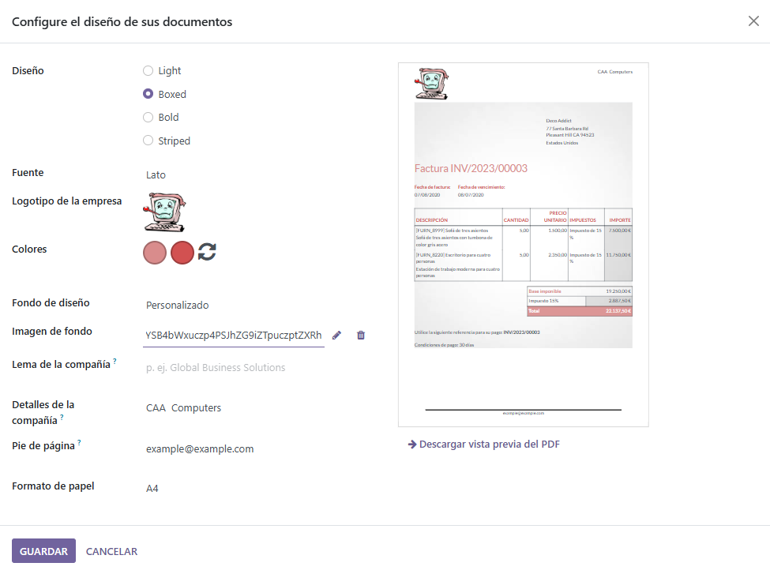
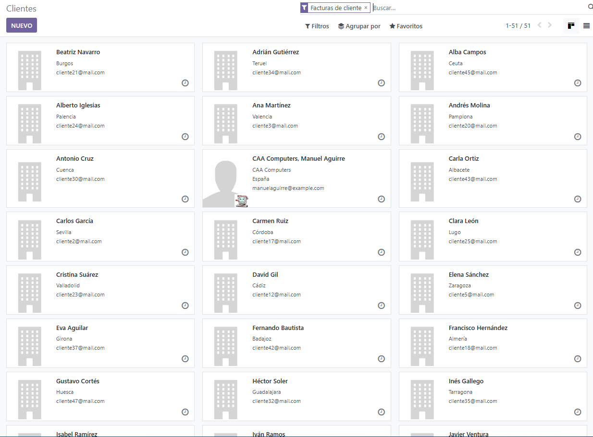
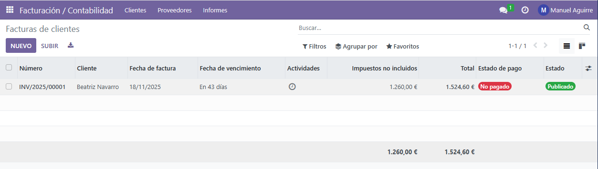

# PR301

## Facturas con Odoo

Comenzamos a configurar Odoo y empezamos con los datos básicos de la empresa, el alta de clientes y la creación de tu primera factura.

Empezaremos introduciendo los datos de la empresa. Para ello deberemos entrar en ajustes, deberemos buscar el apartado de Compañías para actualizar la información de nuestra compañía, poniendo como nombre `CAA Computers`, siendo CAA mis iniciales. 

Continuaremos creando un segundo usuario que tendrá permiso para acceder al módulo de facturación. Dentro de ajustes deberemos buscar el apartado de Usuarios, que está ubicado arriba del todo. Entraremos en "gestionar usuarios" y dentro de la nueva página crearemos un nuevo usuario con acceso único al módulo de facturación. Deberemos acordarnos de una vez creado, seleccionarlo, porque nos saldrá un menú de acción y dentro de él nos permitirá cambiarle la contraseña para poder acceder como él más adelante.

Lo siguiente que se pide configurar son las facturas. Aún dentro de ajustes podremos modificarlo, de modo que buscando el apartado de Compañías de nuevo, encontraremos una configuración que se llamará "Diseño de documento", con un enlace a configurarlo. Le editaremos los colores y le añadiremos una imagen de fondo. 

Nos faltaría en este paso anterior, añadir el QR de pago a las facturas, para ello deberemos irnos, en el menú de ajustes, a Facturación y Contabilidad, desde ahí tendríamos que buscar el apartado de "Pagos de cliente" y seleccionar la casilla que indica del codigo QR.

Ahora podremos continuar importando todos los clientes desde un csv a la empresa. Para importarlos, desde el módulo de Facturación y Contabilidad, deberemos irnos al apartado de clientes, de nuevo a clientes y para poder importar el cv desde ahí, haremos click en Favoritos. Nos saldrá un menú que nos permitirá importar registros. Desde ahí solo deberemos subir el archivo de los clientes y adaptar los campos del excel a Odoo.

Por último, como hablaba en el segundo paso, deberemos conectarnos al usuario que creamos previamente. Cerraremos sesión como administrador y utilizaremos el correo y la contraseña del nuevo usuario para poder entrar y crear una factura. Yo previamente he creado tres productos para añadirlos a la factura. Desde la página de inicio de facturación y contabilidad, con el nuevo usuario, generaríamos una nueva factura y meteríamos los datos deseados.

