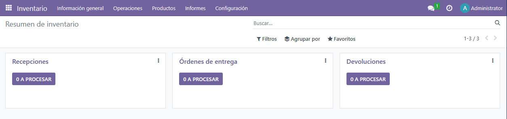
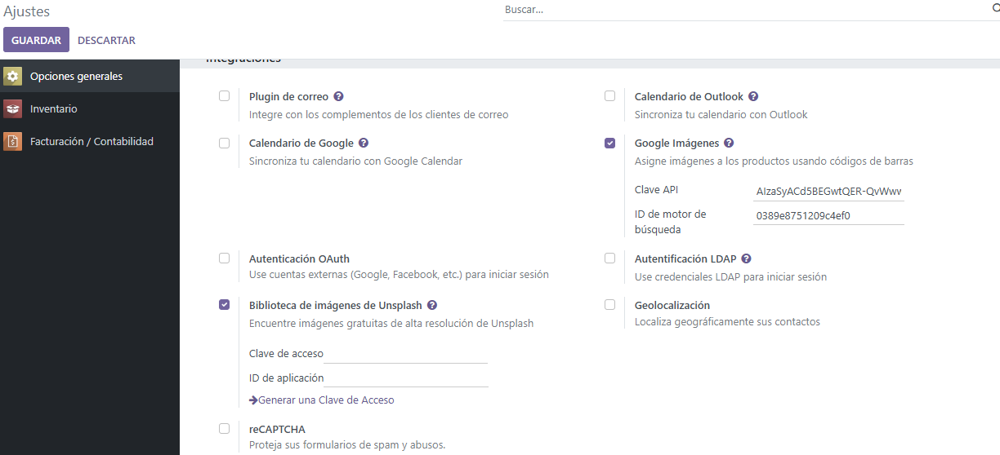
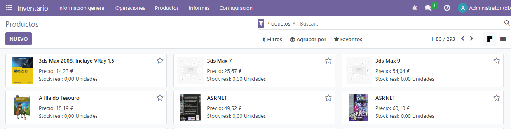

# PR302

## Integración de servicios externos

Seguimos con la empresa de la práctica anterior, ahora comenzaremos activando el módulo de inventario en Odoo.

Para ello, iremos al apartado de aplicaciones, categoría inventario y le haremos click en el botón para activar. Una vez hechos estos pasos, se nos activará el módulo y podremos acceder a él.

Para el siguiente paso descargaremos el excel proporcionado en la actividad y procederemos a importarlo en Inventario, en el apartado productos. Para importarlos, haremos click en Favoritos. Nos saldrá un menú que nos permitirá importar registros. Desde ahí solo deberemos subir el archivo de los productos y adaptar los campos del excel a Odoo.

Una vez importados los campos, para poder continuar deberemos movernos a ajustes, en opciones generales buscar el apartado "Integraciones" y activar la búsqueda de Google Imágenes. Al guardar la configuración, nos aparecerán dos campos en el mismo lugar. Para poder rellenarlos deberemos ir [aquí](https://accounts.google.com/v3/signin/identifier?continue=https%3A%2F%2Fconsole.cloud.google.com%2Fapis%2Fdashboard&dsh=S992241965%3A1763541093531133&followup=https%3A%2F%2Fconsole.cloud.google.com%2Fapis%2Fdashboard&ifkv=ARESoU2PiAe5RpVbeoZFRbHcl8ODA_N6g4-Sl3Ey5RyfQTiFHGbJaoEpvwLLDXgo_n-3SsHu2rRiig&osid=1&passive=1209600&service=cloudconsole&flowName=GlifWebSignIn&flowEntry=ServiceLogin) para generar la clave API desde credenciales  además de habilitar "custom search API" para que funcione. Para rellenar el ID de motor de búsqueda, deberemos ir [aquí](https://programmablesearchengine.google.com/about/) para asignar un buscador rápidamente. Tanto la credencial como el ID del buscador deberemos pegarlos en sus respectivos campos para que funcionen. Deberemos utilizar nuestra cuenta de google para ambos casos.

Para importar las imágenes, vamos al producto en concreto y en acción nos aparecerá una opción de obtener imágenes de Google. Hará una búsqueda y si hay archivos coincidentes la pondrá, sino nos dará el aviso.
