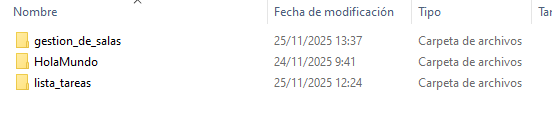
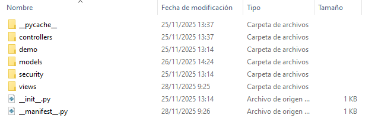
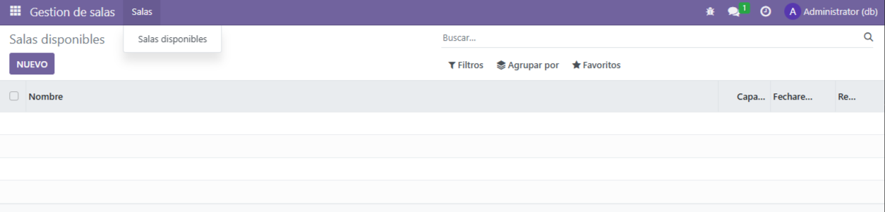

# PR501

## Creación de un módulo básico

### Creación del módulo de trabajo
En esta tarea se pide un sistema de menús con tres niveles. 

```
  Gestión de salas
   |
   |-- Salas
   |     |
   |     |--Salas Disponibles
   |
   |- Reservas
         |
         |- Reservas realizadas (este menú no tendrá acción asociada)
```

Para comenzar con esta tarea, crearemos un módulo, pero no de manera manual, ya que Odoo proporciona una herramienta para ello. Para crearlo deberemos acceder mediante la línea de comandos al contenedor Odoo. Utilizaremos el comando `docker exec -t -i id_contenedor bash`. Dentro del contenedor podremos crear la estructura del módulo con odoo scaffold. 

```
odoo scaffold nombre_modulo /mnt/extra-addons/
```

Es importante que creemos los módulos en *extra-addons*. Una vez ejecutado, se habrán creado las carpetas con las que trabajaremos.



Dentro de Gestión de salas podremos encontrar las siguientes carpetas recién creadas:



### Configuración del módulo

Para crear el módulo que permita gestionar reservas de salas en una empresa, debemos saber que campos tiene que tener. Sabemos que cada reserva tendrá los siguientes campos:

- **Nombre de la Sala**, de tipo texto.
- **Capacidad**, de tipo entero.
- **Fecha de Reserva**, de tipo fecha.
- **Reservada**, de tipo booleano,indicará si está disponible o no.
- **Comentarios** de tipo texto.

Para poder trabajar con esto, en mi caso creé dentro de la carpeta models, un archivo salas_reserva.py, con el siguiente contenido.

```python
# -*- coding: utf-8 -*-

from odoo import models, fields, api


class gestion_de_salas(models.Model):
    _name = 'sala.reserva'
    _description = 'Reserva de salas'

    nombre = fields.Text()
    capacidad = fields.Integer()
    fechaReserva = fields.Date()
    reservada = fields.Boolean()     
    comentarios = fields.Text()
```

Este archivo define el modelo principal del módulo, que gestionará las salas. Aquí representamos una base de datos con los campos especificados en la práctica. 

Una vez modificado, pasaremos a modificar las vistas, desde la carpeta views accederemos a un xml que he creado, views/sala_reserva_views.xml que tiene el siguiente contenido:

```xml
<odoo>
  <data>
    <!-- explicit list view definition -->

    <record model="ir.ui.view" id="view_sala_reserva_tree">
      <field name="name">sala.reserva.tree</field>
      <field name="model">sala.reserva</field>
      <field name="arch" type="xml">
        <tree>
          <field name="nombre"/>
          <field name="capacidad"/>
          <field name="fechaReserva"/>
          <field name="reservada"/>
          <!-- <field name = "comentarios"/> -->
        </tree>
      </field>
    </record>


    <!-- FORM VIEW -->
	<record model="ir.ui.view" id="view_sala_reserva_form">
		<field name="name">sala.reserva.form</field>
			<field name="model">sala.reserva</field>
			<field name="arch" type="xml">
			<form>
				<sheet>
					<group>
						<field name="nombre"/>
						<field name="capacidad"/>
						<field name="fechaReserva"/>
						<field name="reservada"/>
						<field name="comentarios"/>
					</group>
				</sheet>
			</form>
		</field>
	</record>


    <!-- actions opening views on models -->

    <record model="ir.actions.act_window" id="action_salas_disponibles">
      <field name="name">Salas disponibles</field>
      <field name="res_model">sala.reserva</field>
      <field name="view_mode">tree,form</field>
	  <field name="view_id" ref="view_sala_reserva_tree"/>
    </record>

    <!-- Top menu item -->

    <menuitem name="Gestion de salas" id="menu_gestion_salas"/>

    <!-- menu categories -->

    <menuitem name="Salas" id="menu_salas" parent="menu_gestion_salas"/>
    <menuitem name="Reservas" id="menu_reservas" parent="menu_gestion_salas"/>

    <!-- actions -->

    <menuitem name="Salas disponibles" id="menu_salas_disponibles" parent="menu_salas" action="action_salas_disponibles"/>
    <menuitem name="Reservas realizadas" id="menu_reservas_realizadas" parent="menu_reservas"/>

  </data>
</odoo>
```

Aquí se crea una vista en formato lista para visualizar varias salas a la vez y una vista formulario para editar o crear una reserva individual. 

Una vez que estos archivos estén listos tenemos que asegurarnos de que carguen en el módulo, por lo que tendremos que buscar el archivo `__manifest__.py` y añadir nuestro archivo vista.

```python
# -*- coding: utf-8 -*-
{
    'name': "Gestion de salas",

    'summary': "Gestión de reserva de salas",

    'description': "",

    'author': "My Company",
    'website': "https://www.yourcompany.com",

    # Categories can be used to filter modules in modules listing
    # Check https://github.com/odoo/odoo/blob/16.0/odoo/addons/base/data/ir_module_category_data.xml
    # for the full list
    'category': 'Uncategorized',
    'version': '1.0',

    # any module necessary for this one to work correctly
    'depends': ['base'],

    # always loaded
    'data': [
        'security/ir.model.access.csv',
        'views/sala_reserva_views.xml',
    ],
    # only loaded in demonstration mode
    'demo': [
        'demo/demo.xml',
    ],
}
```

Una vez cargado todo esto, podremos comprobar que al instalar el módulo, nos cargará lo deseado.

