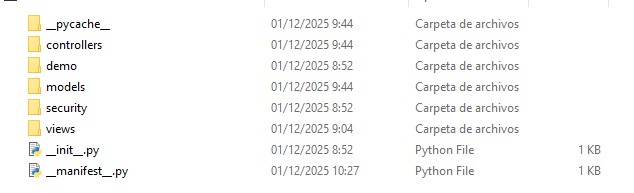
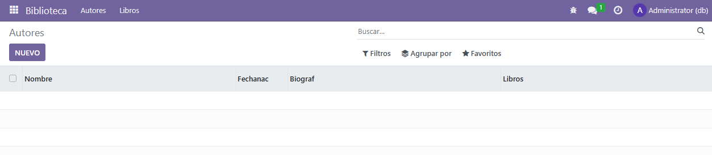

# PR501

## Módulo con dos modelos

### Creación del módulo de trabajo

En esta ocasión vamos a crear un módulo de gestión de biblioteca que contendrá dos modelos, uno para almacenar los autores y otro para los libros. Esto implica que nuestro módulo tendrá dos modelos, y, de forma análoga tendrá una vista para cada modelo. 

Para comenzar con esta tarea, crearemos un módulo, pero no de manera manual, ya que Odoo proporciona una herramienta para ello. Para crearlo deberemos acceder mediante la línea de comandos al contenedor Odoo. Utilizaremos el comando `docker exec -t -i id_contenedor bash`. Dentro del contenedor podremos crear la estructura del módulo con odoo scaffold. 

```
odoo scaffold nombre_modulo /mnt/extra-addons/
```

Es importante que creemos los módulos en *extra-addons*. Una vez ejecutado, se habrán creado las carpetas con las que trabajaremos.


Dentro de Gestión de salas podremos encontrar las siguientes carpetas recién creadas:



### Configuración del módulo

Para crear el módulo que permita los autores y los libros que hay en una biblioteca, debemos saber que campos tiene que tener. Sabemos que cada autor tendrá los siguientes campos:

- **Nombre**
- **Fecha de nacimiento**
- **Biografía**
- **Libros** _(este campo debería ser una relación de uno a muchos en nuestra base de datos, como aún no hemos visto como hacerlo nos limitaremos a dejarlo de tipo texto.)_

Y sabemos que cada libro tendrá los siguientes campos:

- **Nombre**
- **Autor** *(nuevamente, este campo debería estar relacionado con el tro modelo. Por ahora lo dejaremos de tipo char)*
- **Fecha de publicación**
- **ISBN**
- **Sinopsis**

Para poder trabajar con esto, en mi caso creé dentro de la carpeta models, dos archivos llamados: "biblioteca_autores.py" y "biblioteca_libros.py" con el siguiente contenido.

Autores:

```python
# -*- coding: utf-8 -*-

from odoo import models, fields, api


class gestion_de_salas(models.Model):
    _name = 'biblioteca.autor'
    _description = 'Autores'

    nombre = fields.Char()
    fechaNac = fields.Date()
    biograf = fields.Text()     
    libros = fields.Text()
```

Libros:

```python
# -*- coding: utf-8 -*-

from odoo import models, fields, api


class gestion_de_salas(models.Model):
    _name = 'biblioteca.autor'
    _description = 'Autores'

    nombre = fields.Char()
    autor = fields.Text()
    fechaPubl = fields.Date()
    isbn = fields.Integer()     
    sipnosis = fields.Text()
```

Estos archivo define el modelo principal del módulo, que gestionarán los libros y los autores. Aquí representamos una base de datos con dos tablas y los campos especificados en la práctica. 

Una vez modificados, pasaremos a modificar las vistas, desde la carpeta views accederemos a tres xml que he creado, views/biblioteca_autores_view_.xml, views/biblioteca_libros_view_.xml y views/biblioteca_menu_view_.xml que tienen el siguiente contenido.

Autores:

```xml
<odoo>
  <data>
    <!-- explicit list view definition -->
 
    <record model="ir.ui.view" id="view_biblioteca_autor_tree">
      <field name="name">biblioteca.autor.tree</field>
      <field name="model">biblioteca.autor</field>
      <field name="arch" type="xml">
        <tree>
          <field name="nombre"/>
          <field name="fechaNac"/>
          <field name="biograf"/>
          <field name="libros"/>
        </tree>
      </field>
    </record>
 
 
    <!-- actions opening views on models -->
 
    <record model="ir.actions.act_window" id="action_biblioteca_autores">
      <field name="name">Autores</field>
      <field name="res_model">biblioteca.autor</field>
      <field name="view_mode">tree,form</field>
    </record>
  </data>
</odoo>
```

Libros:

```xml
<odoo>
  <data>
    <!-- explicit list view definition -->
 
    <record model="ir.ui.view" id="view_biblioteca_libros_tree">
      <field name="name">biblioteca.libros.tree</field>
      <field name="model">biblioteca.libros</field>
      <field name="arch" type="xml">
        <tree>
          <field name="nombre"/>
          <field name="autor"/>
          <field name="fechaPubl"/>
          <field name="isbn"/>
          <field name="sipnosis"/>
        </tree>
      </field>
    </record>
 
 
    <!-- actions opening views on models -->
 
    <record model="ir.actions.act_window" id="action_biblioteca_libros">
      <field name="name">Libros</field>
      <field name="res_model">biblioteca.libros</field>
      <field name="view_mode">tree,form</field>
    </record>
  </data>
</odoo>
```

Menu:

```xml
<odoo>
  <data>
    <!-- Top menu item -->
    <menuitem name="Biblioteca" id="gestion_de_biblioteca.menu_root"/>
 
    <!-- menu categories -->
 
    <menuitem name="Autores" id="gestion_de_biblioteca.menu_autores" parent="gestion_de_biblioteca.menu_root"/>
    <menuitem name="Libros" id="gestion_de_biblioteca.menu_libros" parent="gestion_de_biblioteca.menu_root"/>
 
    <!-- actions -->
 
    <menuitem name="Listado de Autores" id="gestion_de_biblioteca.menu_autores_list" parent="gestion_de_biblioteca.menu_autores" action="action_biblioteca_autores"/>
    <menuitem name="Listado de Libros" id="gestion_de_biblioteca.menu_libros_list" parent="gestion_de_biblioteca.menu_libros" action="action_biblioteca_libros"/>
  </data>
</odoo>
```

Estos bloques XML definen las vistas y menús del módulo: los archivos de `Autores` y `Libros` crean vistas en formato lista (`tree`) que muestran los campos principales de cada registro y definen acciones (`ir.actions.act_window`) que abren las vistas en modo lista y formulario; el archivo `Menu` añade el menú principal "Biblioteca", crea los submenús "Autores" y "Libros" y enlaza las acciones para que el usuario pueda acceder a los listados desde la interfaz.

Una vez que estos archivos estén listos tenemos que asegurarnos de que carguen en el módulo, por lo que tendremos que buscar el archivo `__manifest__.py` y añadir nuestro archivo vista.

```python
# -*- coding: utf-8 -*-
{
    'name': "gestion_de_biblioteca",
 
    'summary': """
        Short (1 phrase/line) summary of the module's purpose, used as
        subtitle on modules listing or apps.openerp.com""",
 
    'description': """
        Long description of module's purpose
    """,
 
    'author': "My Company",
    'website': "https://www.yourcompany.com",
 
    # Categories can be used to filter modules in modules listing
    # Check https://github.com/odoo/odoo/blob/16.0/odoo/addons/base/data/ir_module_category_data.xml
    # for the full list
    'category': 'Uncategorized',
    'version': '0.1',
 
    # any module necessary for this one to work correctly
    'depends': ['base'],
 
    # always loaded
    'data': [
        'security/ir.model.access.csv',
        'views/biblioteca_autores_view.xml',
        'views/biblioteca_libros_view.xml',
        'views/biblioteca_menu_views.xml',
    ],
    # only loaded in demonstration mode
    'demo': [
        'demo/demo.xml',
    ],
}
```
Nota: en `security/ir.model.access.csv` se definen los permisos de acceso a los modelos; en este ejemplo hay una fila que debe corregirse para que el `id`, el `name` y el `model_id` apunten al mismo modelo.

```csv
id,name,model_id:id,group_id:id,perm_read,perm_write,perm_create,perm_unlink
access_biblioteca_autor,access_biblioteca_autor,model_biblioteca_autor,base.group_user,1,1,1,1
access_biblioteca_libros,access_biblioteca_libros,model_biblioteca_libros,base.group_user,1,1,1,1
```

Una vez cargado todo esto, podremos comprobar que al instalar el módulo, nos cargará lo deseado.

