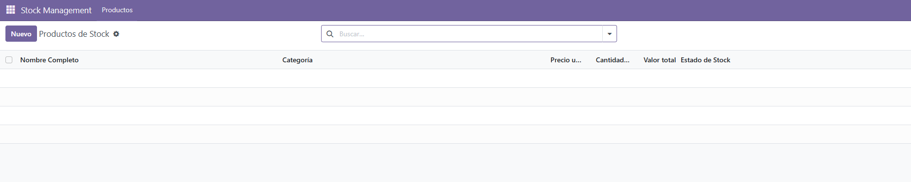
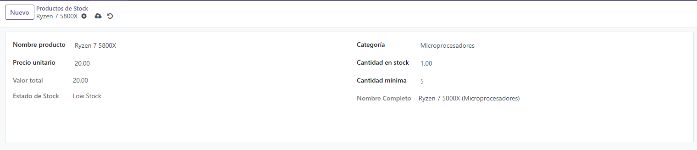
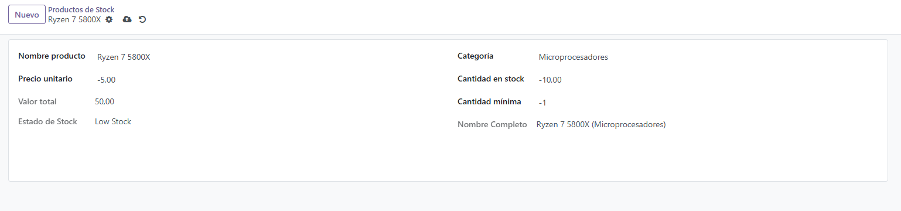
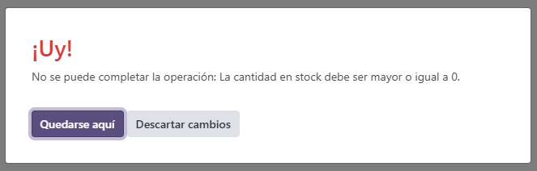

# PR603
## PR0603: Campos calculados y restricciones
### Creacion de los campos
En esta tarea se pide:
* **Nombre del módulo:** `stock_management`
* **Modelos:** tendrá un único modelo que se llamará `stock.product`
* **Campos del modelo:** el modelo tendrá los siguientes campos:
    * `name` : nombre del producto
    * `category` : categoría del producto, será un `Selection`
    * `price` : precio unitario del producto
    * `quantity` : cantidad en stock
    * `total_value` : campo calculado con el valor total del stock (precio por la cantidad total)
    * `minimum_quantity` : valor entero
    * `stock_status` : campo calculado de tipo `Selection`. Podrá ser *normal* si la cantidad es superior a la cantidad mínima y *Low Stock* si es inferior.
    * `full_name` : el nombre completo será un campo calculado que generará a partir del nombre y de la categoría. Por ejemplo: `Ryzen 7 5800X (Microprocesadores)`
* **Restricciones:** tienes que aplicar las siguientes restricciones:
    * **SQL:**
        * El nombre del producto debe ser único
        * La cantidad en stock debe ser mayor a igual a 0
    * **Python:**
        * El precio debe ser mayor que 0
        * La cantidad debe ser mayor o igual a 0
        * El valor total del stock no puede ser superior a 100000 unidades monetarias
        * No se permiten productos sin categoría


**models.py**
```py
# -*- coding: utf-8 -*-
from odoo import models, fields, api
from odoo.exceptions import ValidationError

class StockProduct(models.Model):
    _name = 'stock.product'
    _description = 'Gestión de Stock'

    _sql_constraints = [
        ('unique_name', 'unique(name)', 'El nombre del producto debe ser único.'),
        ('check_quantity_positive', 'CHECK(quantity >= 0)', 'La cantidad en stock debe ser mayor o igual a 0.'),
    ]

    name = fields.Char(string='Nombre producto', required=True)
    
    category = fields.Selection([
        ('microprocesadores', 'Microprocesadores'),
        ('ratones', 'Ratones'),
        ('teclados', 'Teclados'),
        ('monitores', 'Monitores'),
    ], string='Categoría', required=True) 
    
    price = fields.Float(string='Precio unitario')
    quantity = fields.Float(string='Cantidad en stock')
    
    total_value = fields.Float(
        string='Valor total', 
        compute='_compute_total_value', 
        store=True)
    
    minimum_quantity = fields.Integer(string='Cantidad mínima')
    
    stock_status = fields.Selection([
        ('normal', 'Normal'),
        ('low', 'Low Stock'),
    ], string='Estado de Stock', compute='_compute_stock_status')
    
    full_name = fields.Char(string='Nombre Completo', compute='_compute_full_name')


    @api.depends('price', 'quantity')
    def _compute_total_value(self):
        for record in self:
            record.total_value = record.price * record.quantity

    @api.depends('quantity', 'minimum_quantity')
    def _compute_stock_status(self):
        for record in self:
            if record.quantity < record.minimum_quantity:
                record.stock_status = 'low'
            else:
                record.stock_status = 'normal'

    @api.depends('name', 'category')
    def _compute_full_name(self):
        for record in self:
            cat_label = dict(self._fields['category'].selection).get(record.category)
            if record.name and cat_label:
                record.full_name = f"{record.name} ({cat_label})"
            else:
                record.full_name = record.name

    @api.constrains('price', 'quantity', 'total_value')
    def _check_business_rules(self):
        for record in self:
            if record.price <= 0:
                raise ValidationError('El precio debe ser mayor que 0.')
            
            if record.quantity < 0:
                raise ValidationError('La cantidad debe ser mayor o igual a 0.')
            
            if record.total_value > 100000:
                raise ValidationError('El valor total del stock no puede ser superior a 100,000 unidades monetarias.')
```

En este models encontramos muchas restricciones importantes:
```py
    _sql_constraints = [
        ('unique_name', 'unique(name)', 'El nombre del producto debe ser único.'),
        ('check_quantity_positive', 'CHECK(quantity >= 0)', 'La cantidad en stock debe ser mayor o igual a 0.'),
    ]
```
Esta restriccion de sql se ejecuta a nivel de la base de datos, en esta podemos encontrar un **unique_name** que se encargara que el campo *name* sea unico y tambien tendremos **check_quantity_positive** que tan solo comprueba de que el campo *quantity* sea mayor de 0 
ock nunca sea negativo.


Tambien tenemos campos que usaran el ```@api.constrains``` o ```@api.depends```
que son los siguientes:
```py
    total_value = fields.Float(
        string='Valor total', 
        compute='_compute_total_value', 
        store=True)

    stock_status = fields.Selection([
        ('normal', 'Normal'),
        ('low', 'Low Stock'),
    ], string='Estado de Stock', compute='_compute_stock_status')

    full_name = fields.Char(string='Nombre Completo',                       compute='_compute_full_name')
```

Estos campos usaran las siguientes restricciones de python
```py
    @api.depends('price', 'quantity')
    def _compute_total_value(self):
        for record in self:
            record.total_value = record.price * record.quantity

    @api.depends('quantity', 'minimum_quantity')
    def _compute_stock_status(self):
        for record in self:
            if record.quantity < record.minimum_quantity:
                record.stock_status = 'low'
            else:
                record.stock_status = 'normal'

    @api.depends('name', 'category')
    def _compute_full_name(self):
        for record in self:
            cat_label = dict(self._fields['category'].selection).get(record.category)
            if record.name and cat_label:
                record.full_name = f"{record.name} ({cat_label})"
            else:
                record.full_name = record.name

    @api.constrains('price', 'quantity', 'total_value')
    def _check_values(self):
        for record in self:
            if record.price <= 0:
                raise ValidationError('El precio debe ser mayor que 0.')
            
            if record.quantity < 0:
                raise ValidationError('La cantidad debe ser mayor o igual a 0.')
            
            if record.total_value > 100000:
                raise ValidationError('El valor total del stock no puede ser superior a 100,000 unidades monetarias.')
```
- **def _compute_total_value:** Esta se encarga de actualizar el campo **total_value** por el resultado el precio por la cantidad

- **def_compute_stock_stat:** Aqui se actualiza automaticamente el campo **stock_status**, teniendo como condiciones que si la cantidad es menor que el minimo de la cantidad lo ponga como *low* si no como *normal*

- **def _compute_full_name:** Aqui indicamos que el campo full_name debe ser la concatenacion de el campo *name* mas la *category*

- **def _check_values**: Comprobamos de que los vlores no sean negativos, y en caso de que sean negativos mostraremos un error

## Archivos modificados
### View
```xml
<?xml version="1.0" encoding="utf-8"?>
<odoo>
    <record id="view_stock_product_tree" model="ir.ui.view">
        <field name="name">stock.product.tree</field>
        <field name="model">stock.product</field>
        <field name="arch" type="xml">
            <tree>
                <field name="full_name"/>
                <field name="category"/>
                <field name="price"/>
                <field name="quantity"/>
                <field name="total_value"/>
                <field name="stock_status"/>
            </tree>
        </field>
    </record>

    <record id="action_stock_product" model="ir.actions.act_window">
        <field name="name">Productos de Stock</field>
        <field name="res_model">stock.product</field>
        <field name="view_mode">tree,form</field>
    </record>

    <menuitem id="menu_stock_root" name="Stock Management"/>
    <menuitem id="menu_stock_product" name="Productos" parent="menu_stock_root" action="action_stock_product"/>
</odoo>
```

```csv
id,name,model_id:id,group_id:id,perm_read,perm_write,perm_create,perm_unlink
access_stock_product_user,access_stock_product_user,model_stock_product,,1,1,1,1
```

## Funcionamiento



